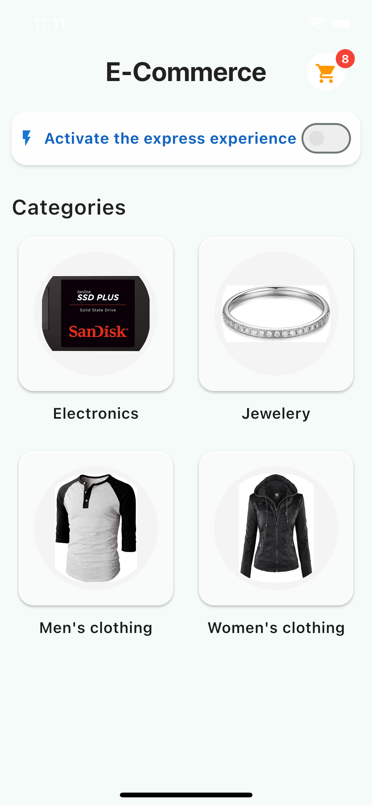
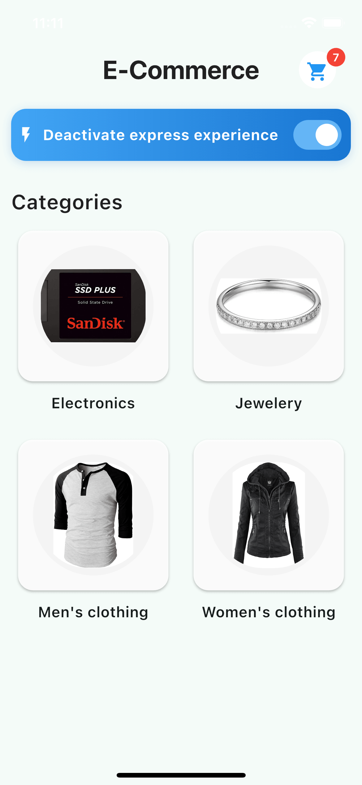
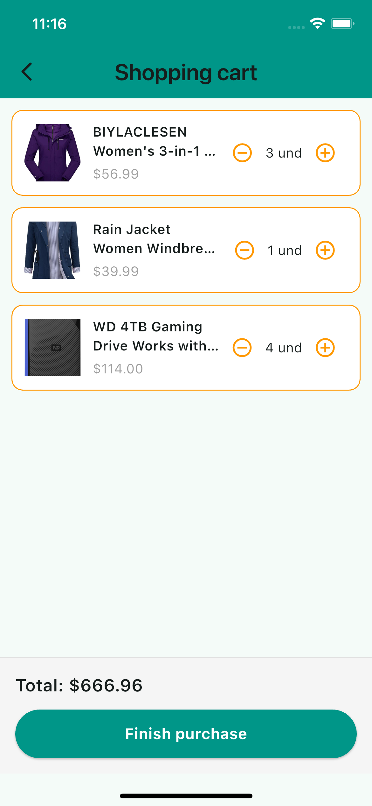
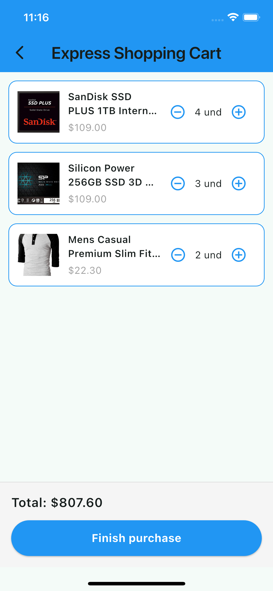

# e-commerce_app

Una aplicación de ecommerce construida en Flutter usando Clean Architecture y Riverpod 2.x. Permite explorar productos, agregar al carrito, y realizar compras normales o en modo express.

## 🚀 Características

- 📦 Listado de productos por categoría
- 🛒 Carrito persistente (modo normal y express)
- 🔁 Cambio de carrito dinámico por horario (10:00 a.m. a 4:00 p.m.)
- 🧩 Arquitectura limpia (data, domain, presentation)
- ⚙️ Inyección de dependencias con Riverpod + `@riverpod` generator
- 🖼️ UI inspirada en ecommerce real: diseño tipo cuadrícula con imágenes

  ---

## 📸 Capturas de pantalla

### 📁 Categorías

| Normal | Modo Express |
|--------|---------------|
|  |  |

---

### 🛍️ Productos

| Normal | Modo Express |
|--------|---------------|
|  |  |

---

### 🛒 Carrito

| Normal | Modo Express |
|--------|---------------|
|  |  |

---

## API
La aplicación consume datos de Fake Store API

Endpoint: https://fakestoreapi.com/docs

---

## 🧱 Estructura del proyecto

```bash
lib/
├── core/                # utilidades generales y helpers
├── features/            # cada feature con su dominio/data/presentación
│   ├── category/
│   ├── product/
│   └── cart/
├── shared/              # elementos compartidos: widgets, themes, providers
└── main.dart            # punto de entrada
```

## 🛠️ Tecnologías usadas

- Flutter 3.x
- Riverpod 2.x + code generation
- Dio
- Freezed
- GoRouter
- FakeStoreAPI como backend temporal

## 📦 Cómo correr el proyecto

### 1. Clonar el repositorio
```bash
https://github.com/Jess-Jh/e-commerce-app.git
```
### 2. Navegar al directorio del proyecto
``` bash
cd ecommerce_app
```
### 3. Instalar las dependencias
``` bash
- flutter pub get
```
### 4. Generar archivos con build_runner
``` bash
- flutter pub run build_runner build --delete-conflicting-outputs
```
### 5. Ejecutar la aplicación
```bash
- flutter run
```

---

## Agradecimientos
Agradecimientos a [Fake Store API](https://fakestoreapi.com) por proporcionar los datos utilizados en esta aplicación.


